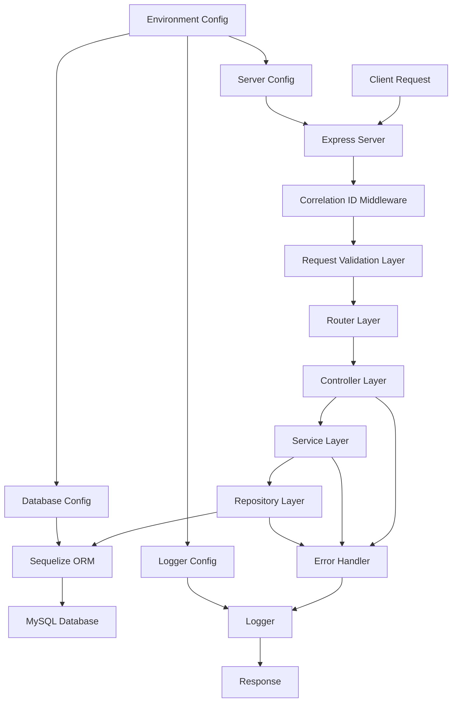
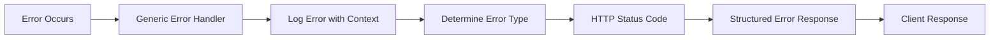
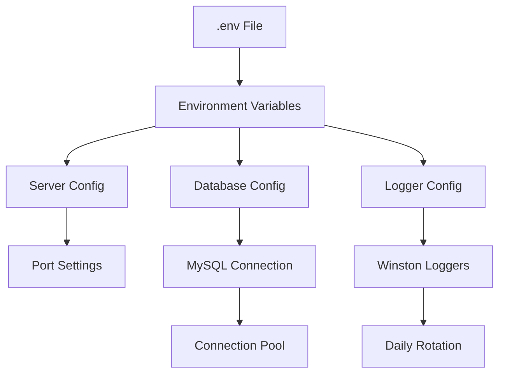
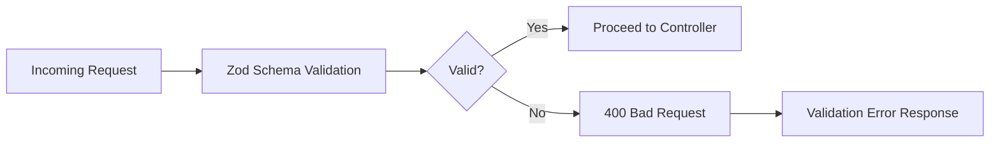

# Hotel Service API

A comprehensive hotel management REST API built with Express.js, TypeScript, and Sequelize ORM. This service provides endpoints for managing hotels, rooms, and related operations with robust validation, error handling, and logging.

## Features

- **Hotel Management**: CRUD operations for hotels
- **Room Generation**: Dynamic room generation for hotels
- **TypeScript**: Full type safety and modern JavaScript features
- **Database Integration**: MySQL with Sequelize ORM
- **Validation**: Request validation using Zod schemas
- **Logging**: Winston-based structured logging with rotation
- **Error Handling**: Centralized error handling middleware
- **API Versioning**: Support for multiple API versions (v1, v2)

## Tech Stack

- **Runtime**: Node.js
- **Framework**: Express.js 5.x
- **Language**: TypeScript
- **Database**: MySQL
- **ORM**: Sequelize 6.x
- **Validation**: Zod
- **Logging**: Winston
- **Development**: Nodemon, tsx

## Prerequisites

- Node.js (v16 or higher)
- MySQL database
- npm or yarn

## Installation & Setup

1. **Clone the repository**
   ```bash
   git clone https://github.com/VivekKumarDwivedi/Express-TypeScript-Starter-Project.git hotelService
   cd hotelService
   ```

2. **Install dependencies**
   ```bash
   npm install
   ```

3. **Environment Configuration**
   
   Create a `.env` file in the root directory with the following variables:
   ```env
   PORT=3000
   DB_HOST=localhost
   DB_USER=root
   DB_PASSWORD=your_password
   DB_NAME=hotel_db
   ```

4. **Database Setup**
   
   Run database migrations:
   ```bash
   npm run migrate
   ```

5. **Start the Development Server**
   ```bash
   npm run dev
   ```

## Available Scripts

- `npm run dev` - Start development server with hot reload
- `npm start` - Start production server
- `npm run build` - Compile TypeScript to JavaScript
- `npm run migrate` - Run database migrations
- `npm run rollback` - Rollback last migration

## API Endpoints

### Base URL
```
http://localhost:3000/api/v1
```

### Hotels
- `GET /hotels` - Get all hotels
- `GET /hotels/:id` - Get hotel by ID
- `POST /hotels` - Create a new hotel
- `PUT /hotels/:id` - Update hotel details
- `DELETE /hotels/:id` - Delete a hotel

### Rooms
- `POST /rooms/generate` - Generate rooms for a hotel

### Health Check
- `GET /ping` - API health check

## Project Structure & Workflow

```
src/
├── config/          # Configuration files (database, server, logging)
├── controllers/     # Request handlers
├── db/             # Database models and migrations
├── dto/            # Data transfer objects
├── middlewares/    # Express middlewares
├── repositories/   # Data access layer
├── routers/        # API routes (v1, v2)
├── services/       # Business logic layer
├── utils/          # Utility functions
├── validators/     # Request validation schemas
└── server.ts       # Application entry point
```

### Advanced Workflow Architecture



### Request Flow Process

1. **Request Entry**
   - Client sends HTTP request to `/api/v1` or `/api/v2`
   - Express server receives and processes request

2. **Middleware Pipeline**
   - **Correlation Middleware**: Attaches unique request ID for tracking
   - **JSON Parser**: Parses request body
   - **Validation Layer**: Validates request against Zod schemas

3. **Routing Layer**
   - Routes request to appropriate controller based on path
   - Supports hotel operations (`/hotels`) and room generation (`/rooms`)

4. **Controller Layer**
   - Handles HTTP request/response logic
   - Calls service layer for business operations
   - Manages error responses and status codes

5. **Service Layer**
   - Implements business logic and rules
   - Coordinates between controllers and repositories
   - Handles complex operations like room generation

6. **Repository Layer**
   - Data access abstraction
   - Sequelize ORM operations
   - Database query management

7. **Database Layer**
   - MySQL database with Sequelize models
   - Handles data persistence and retrieval
   - Manages transactions and relationships

### Error Handling Flow



### Configuration Architecture



### Data Transfer Objects (DTOs)

- **Request DTOs**: Validated input data structures
- **Response DTOs**: Standardized output formats
- **Database DTOs**: Entity mapping objects

### Validation Pipeline



### Logging Strategy

- **Request Logging**: Incoming requests with correlation IDs
- **Error Logging**: Structured error information
- **Performance Logging**: Response times and metrics
- **Daily Rotation**: Automatic log file management

## Database Schema

The service uses Sequelize ORM with MySQL. The main entities include:
- Hotels (hotel information)
- Rooms (room details and availability)

## Error Handling

The API implements centralized error handling with:
- Structured error responses
- Proper HTTP status codes
- Request correlation IDs for debugging
- Comprehensive logging

## Logging

Logs are managed using Winston with:
- Daily log rotation
- Different log levels (info, warn, error)
- Structured log format with correlation IDs

## Contributing

1. Fork the repository
2. Create a feature branch
3. Make your changes
4. Add tests if applicable
5. Submit a pull request

## License

ISC License
